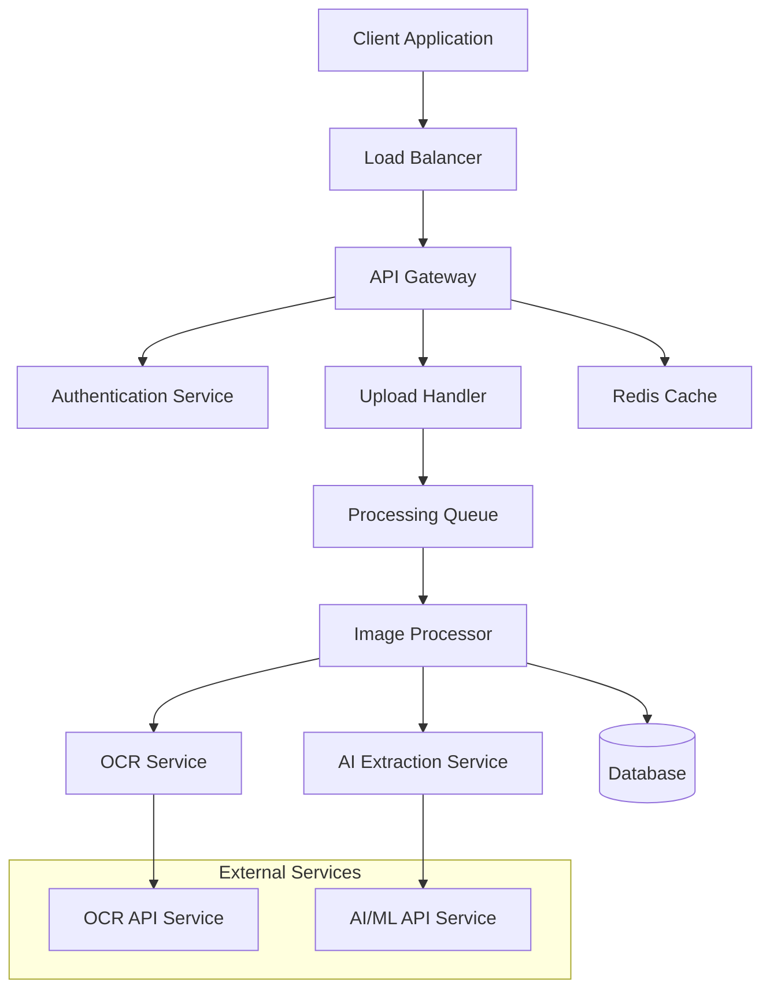

# Document de Conception - API d'Analyse de Reçus

## Vue d'ensemble

L'API d'Analyse de Reçus est un service backend REST qui utilise des technologies d'OCR (Optical Character Recognition) et d'intelligence artificielle pour extraire automatiquement les informations clés des images de reçus. Le système est conçu pour être scalable, sécurisé et capable de traiter différents types de documents de transaction.

## Architecture

### Architecture Générale



### Composants Principaux

1. **API Gateway** : Point d'entrée unique pour toutes les requêtes
2. **Upload Handler** : Gestion des uploads d'images avec validation
3. **Processing Queue** : Queue asynchrone pour le traitement des images
4. **Image Processor** : Orchestrateur du processus d'extraction
5. **OCR Service** : Service d'extraction de texte depuis les images
6. **AI Extraction Service** : Service d'analyse intelligente des données extraites
7. **Database** : Stockage des résultats et métadonnées
8. **Cache Layer** : Cache Redis pour les réponses fréquentes

## Composants et Interfaces

### 1. API Gateway

**Responsabilités :**
- Routage des requêtes
- Authentification et autorisation
- Rate limiting
- Validation des requêtes
- Gestion des réponses d'erreur

**Endpoints principaux :**
```
POST /api/v1/receipts/analyze
GET  /api/v1/receipts/{id}/status
GET  /api/v1/receipts/{id}/result
GET  /health
```

### 2. Upload Handler

**Responsabilités :**
- Validation du format d'image (JPEG, PNG, PDF)
- Vérification de la taille (max 10MB)
- Génération d'ID unique pour chaque traitement
- Stockage temporaire sécurisé des images

**Interface :**
```typescript
interface UploadRequest {
  image: File;
  clientId?: string;
  metadata?: {
    source?: string;
    expectedType?: 'retail' | 'card_payment' | 'cash_register';
  };
}

interface UploadResponse {
  requestId: string;
  status: 'uploaded' | 'processing' | 'completed' | 'failed';
  estimatedProcessingTime: number;
}
```

### 3. Image Processor

**Responsabilités :**
- Orchestration du pipeline de traitement
- Préparation et nettoyage des images
- Coordination entre OCR et AI services
- Assemblage des résultats finaux

**Pipeline de traitement :**
1. Préprocessing de l'image (rotation, contraste, résolution)
2. Extraction OCR du texte brut
3. Analyse AI pour identifier les champs structurés
4. Post-processing et validation des données
5. Formatage de la réponse JSON

### 4. OCR Service

**Responsabilités :**
- Extraction de texte depuis les images
- Détection de la langue
- Reconnaissance de la structure du document

**Technologies suggérées :**
- Tesseract OCR pour le traitement local
- Google Vision API ou AWS Textract comme alternative cloud
- Preprocessing avec OpenCV pour améliorer la qualité

### 5. AI Extraction Service

**Responsabilités :**
- Identification des champs spécifiques (montant, date, enseigne)
- Classification du type de reçu
- Génération du résumé des achats
- Validation de la cohérence des données

**Approche :**
- Modèles de NLP pré-entraînés pour l'extraction d'entités
- Règles métier pour la validation des montants et dates
- Patterns regex pour les formats de données spécifiques

## Modèles de Données

### Receipt Analysis Request
```typescript
interface ReceiptAnalysisRequest {
  id: string;
  clientId: string;
  imageUrl: string;
  imageMetadata: {
    format: string;
    size: number;
    dimensions: { width: number; height: number };
  };
  status: 'pending' | 'processing' | 'completed' | 'failed';
  createdAt: Date;
  updatedAt: Date;
}
```

### Extracted Receipt Data
```typescript
interface ExtractedReceiptData {
  requestId: string;
  receiptType: 'retail' | 'card_payment' | 'cash_register' | 'unknown';
  extractedFields: {
    totalAmount: {
      value: number;
      currency: string;
      confidence: number;
    };
    date: {
      value: string; // ISO 8601 format
      confidence: number;
    };
    merchantName: {
      value: string;
      confidence: number;
    };
    items: Array<{
      name: string;
      quantity?: number;
      unitPrice?: number;
      totalPrice?: number;
    }>;
    summary: string;
  };
  processingMetadata: {
    processingTime: number;
    ocrConfidence: number;
    aiConfidence: number;
  };
  extractedAt: Date;
}
```

### API Response Format
```typescript
interface AnalysisResponse {
  success: boolean;
  requestId: string;
  data?: ExtractedReceiptData;
  error?: {
    code: string;
    message: string;
    details?: any;
  };
  processingTime: number;
}
```

## Gestion des Erreurs

### Codes d'Erreur Standardisés

| Code HTTP | Code Erreur | Description |
|-----------|-------------|-------------|
| 400 | INVALID_FORMAT | Format d'image non supporté |
| 400 | FILE_TOO_LARGE | Taille de fichier dépassée |
| 422 | POOR_IMAGE_QUALITY | Qualité d'image insuffisante pour l'analyse |
| 422 | NO_TEXT_DETECTED | Aucun texte détecté dans l'image |
| 429 | RATE_LIMIT_EXCEEDED | Limite de requêtes dépassée |
| 500 | PROCESSING_ERROR | Erreur interne de traitement |
| 503 | SERVICE_UNAVAILABLE | Service temporairement indisponible |

### Stratégie de Retry

- Retry automatique pour les erreurs temporaires (503, timeouts)
- Exponential backoff pour les services externes
- Circuit breaker pour les services OCR/AI externes
- Fallback vers des services alternatifs si disponibles

## Stratégie de Test

### Tests Unitaires
- Validation des formats d'image
- Logique d'extraction de données
- Formatage des réponses JSON
- Gestion des cas d'erreur

### Tests d'Intégration
- Pipeline complet de traitement d'image
- Intégration avec services OCR/AI externes
- Tests de performance avec différentes tailles d'image
- Tests de charge pour valider la scalabilité

### Tests End-to-End
- Scénarios utilisateur complets via l'API
- Tests avec différents types de reçus réels
- Validation de la précision d'extraction
- Tests de récupération après panne

### Jeux de Données de Test
- Collection de reçus de différents types et qualités
- Images avec différentes résolutions et orientations
- Cas limites (reçus partiellement lisibles, formats atypiques)
- Données de référence pour validation de la précision

## Considérations de Sécurité

### Protection des Données
- Chiffrement des images en transit et au repos
- Suppression automatique des images après traitement
- Anonymisation des données extraites si nécessaire
- Conformité RGPD pour les données personnelles

### Authentification et Autorisation
- API Keys pour l'authentification des clients
- Rate limiting par client et par IP
- Validation et sanitisation de tous les inputs
- Logs d'audit pour toutes les opérations

## Performance et Scalabilité

### Optimisations Performance
- Cache Redis pour les résultats fréquents
- Compression des images avant traitement
- Traitement asynchrone avec queues
- Parallélisation du pipeline OCR/AI

### Scalabilité Horizontale
- Architecture microservices containerisée
- Load balancing avec health checks
- Auto-scaling basé sur la charge de la queue
- Séparation des services de lecture/écriture

### Monitoring et Métriques
- Temps de traitement par type de reçu
- Taux de succès d'extraction par champ
- Utilisation des ressources système
- Alertes sur les erreurs et latences